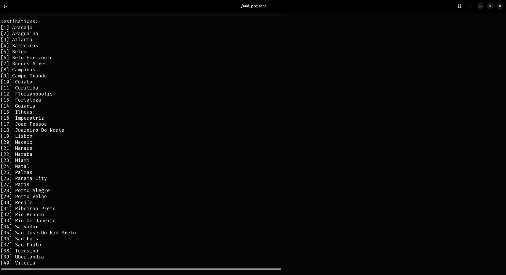
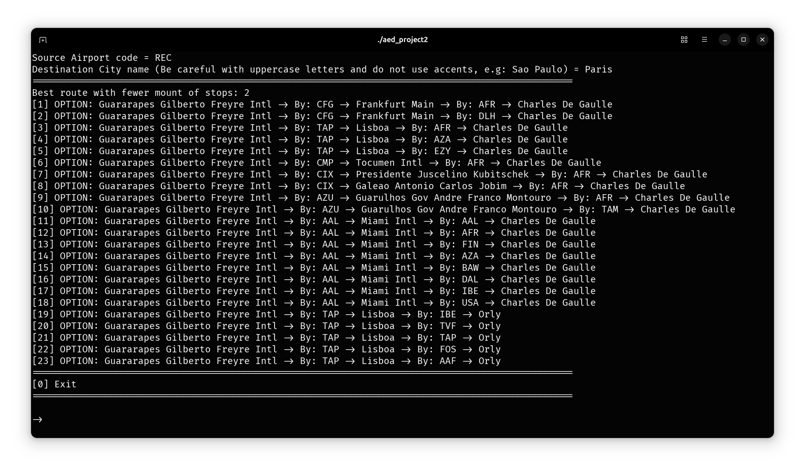

## Introduction

Air transport plays a crucial role in global connectivity by bridging the distance between countries and continents. This project develops a Flight Network Management System in C++ that processes real-world data about airports, airlines, and flights to provide users a comprehensive tool for making informed decisions.

## Overview

The main objectives of this project are to:

- **Parse and Load Data:** Import data from CSV files containing details on airports, airlines, and flights.
- **Graph Construction:** Represent the air travel network as a graph where airports are vertices and flights are directed edges.
- **Network Analysis:** Compute global statistics, determine connectivity, and analyze flight routes.
- **Flight Search:** Identify the best flight options (with the least number of stops) between source and destination locations.
- **Critical Connectivity:** Identify essential airports whose removal would significantly disrupt network connectivity.

## Implementation

### Data Parsing and Graph Construction

The project uses three main CSV files:

- **`airports.csv`**: Contains data on 3019 airports (IATA code, name, city, country, latitude, longitude).
- **`airlines.csv`**: Contains data on 444 airlines (ICAO code, official name, callsign, country).
- **`flights.csv`**: Contains data on 63832 flights (source IATA code, destination IATA code, airline ICAO code).

The `FlightNetwork` class builds the network by:

- **Parsing Airports:** Each line is read to create an `Airport` object with its code, name, city, country, and geographic coordinates. These are added as vertices in a graph.
- **Parsing Flights:** For every flight, the corresponding source and destination airports are found in the graph. An edge is added between these vertices, with the flight distance computed via the **Haversine formula**.

The Haversine formula is implemented in a dedicated function that calculates the great-circle distance between two geographic coordinates, ensuring that flight distances are accurately represented.

### Key Functionalities

- **Global Statistics:**
  - Total number of airports and available flights.
  - Number of flights from an airport, including counts per airline.

- **Destination Analysis:**
  - List of reachable destinations (airports, cities, countries) from a given airport.
  - Computation of reachable nodes within a certain number of stops.

- **Flight Options:**
  - Calculation of the best flight route (with the fewest stops) between a source and destination.
  - Filtering options to consider only specific airlines or minimize the variety of airlines used.

- **Critical Network Nodes:**
  - Identification of essential airports whose removal would break connectivity in the network.

## Challenges and Solutions

- **Robust Data Parsing:**
  Handling large CSV files with variable data formats required careful use of string streams and error checking.

- **Memory Management:**
  Since the project deals with a large number of nodes and edges, dynamic memory allocation was managed meticulously to avoid leaks and ensure efficient performance.

- **Algorithm Complexity:**
  Implementing efficient BFS and DFS algorithms was critical, especially for functions that compute the best flight routes or analyze network connectivity.

- **Edge Cases:**
  Special care was taken to handle cases such as missing data, duplicate entries, and ensuring the correct mapping of airport and airline codes to their full names.

## Demonstration

Upon running the project, users are presented with two main options: viewing statistics and searching for flights. This section is a quick demo of 2 of the various funcionalities implemented on the system.

### Statistics

A key feature of this project is the ability to view the number of reachable destinations (airports, cities, or countries) from a specified airport within a maximum number of X stops (layovers). This functionality is implemented using Depth-First Search (DFS) algorithms.

```cpp
set<string> FlightNetwork::getReachableCities(const Airport &airport, const int &distance)
{
    set<string> reachableCities;
    vector<Airport> aux = airportsGraph.nodesAtDistanceDFS(airport, distance);

    for (const Airport &air : aux)
        reachableCities.insert(air.getCity());

    return reachableCities;
}
```

For example, when searching for the cities reachable from the Petrolina airport (PNZ) with 2 stops maximum, we can see the following output:



### Flight Search

The flight search functionality is highly versatile, allowing users to search for flights using a combination of airports, cities, or geographic coordinates. Also, it supports various filters, such as minimizing the number of airlines or specifying preferred airlines to fly with.

For example, when searching for the best flight from Recife (REC) to Paris, the system provides 23 different options. All options include one stop, as there are no direct flights for this route. The output specifies the airline for each flight and the connecting airports in Paris. Since Paris has multiple airports, the results include various destination airports within the city.


