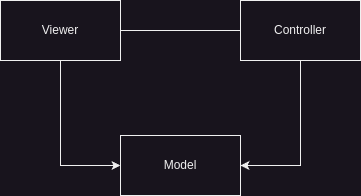
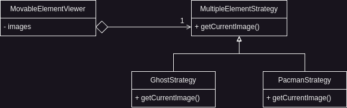
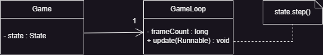
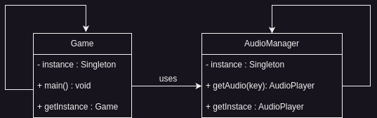

## Overview

This project is a text-based implementation of the classic Pacman game built in Java using the Lanterna library. It recreates the original arcade experience while demonstrating object-oriented programming principles and design patterns.

## Features

- **Player Control**: Four-directional movement for Pacman
- **Ghost AI**: Each ghost has unique movement patterns
- **Collectibles**: Coins, fruits, and power-ups that affect gameplay
- **Multiple Maps**: Five different levels including "Spirals", "Stripes", and "Islands"
- **Multiplayer Mode**: Two-player cooperative gameplay
- **Audio**: Background music and sound effects
- **Menu System**: Main menu, pause, and map selection

## Architecture & Design

The project uses several design patterns to organize the code effectively:

### MVC Pattern

- **Model**: Game entities like Pacman, ghosts, and collectibles
- **View**: Rendering components that display game elements
- **Controller**: Input handling and game logic



### Key Design Patterns

- **Singleton**: Game instance and audio manager for centralized control
- **State**: Different game phases (menu, gameplay, end screens)
- **Factory**: Centralized creation of viewer components
- **Strategy**: Different ghost AI behaviors and rendering methods



## Technical Implementation

### Core Game Engine

The game engine is built around a centralized `Game` class that manages:

```java
public class Game {
    private static Game instance;
    private State state;
    private LanternaGUI gui;

    public void run() {
        // 60 FPS game loop implementation
        while (running) {
            processInput();
            update();
            render();
        }
    }
}
```



### Entity Management

Each game entity follows a consistent structure with model, view, and controller components:

- **Pacman**: Player-controlled character with collision detection and item collection
- **Ghosts**: AI-driven entities with unique movement patterns and state management
- **Collectibles**: Static items with pickup detection and scoring mechanics

### Map System

The game supports multiple map configurations loaded from text files:

- **Single Player Maps**: Optimized for solo gameplay
- **Multiplayer Maps**: Designed for cooperative two-player experience
- **Special Levels**: Unique challenges like "Final Boss" with enhanced difficulty

### Audio Architecture

The `AudioManager` singleton handles all audio operations:

- Background music looping
- Sound effect triggering
- Volume control and audio resource management



## Testing & Quality Assurance

The project implements comprehensive testing strategies:

- **Unit Testing**: JUnit for component testing
- **Mocking**: Mockito for isolated testing scenarios
- **Mutation Testing**: PiTest for code quality verification
- **Test Coverage**: Jacoco for coverage analysis
- **Property-Based Testing**: jqwik for robust test case generation

## Conclusion

This project highlights how solid software engineering practices can elevate game development. By applying design patterns, thoughtful testing strategies, and clean architectural principles, it not only delivers an enjoyable gaming experience but also results in a codebase that is easy to understand, extend, and maintain.
