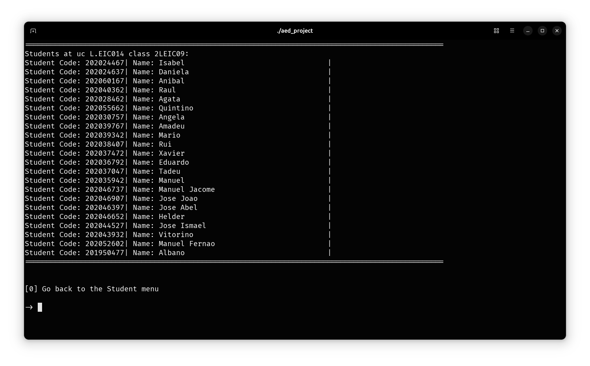

## Introduction

This project implements a schedule management to modify, search, view, sort and list L.EIC (Licenciatura em Engenharia Informática e Computação) schedules. It was developed as part of the Algorithms and Data Structures course. The system manages existing schedules through an object-oriented approach with efficient data structure implementation.

## Overview

The schedule management system is built around several core functionalities:

- CSV file parsing and data extraction for student, class, and course information.
- Real-time schedule consultation and modification through an command-line interface.
- Rule-based validation for registration changes.
- Chronological tracking of modifications with undo capabilities.

## Core Components

The project is structured around several key classes, each handling specific aspects of the scheduling system:

- **App**: Main application interface.
- **Student**: Manages student data and their associated schedules.
- **Lecture**: Represents individual class sessions with timing and type.
- **UC**: Bundler for a course unit with its associated classes.
- **Request**: Provides methods for adding, removing, and switching courses and classes for students.
- **Script**: Handles file operations and data extraction.

## File Processing

A significant aspect of the system is its file-based data handling through the `Script` class. For example, the `studentsinClass` function extracts student information for a specific class:

```cpp
vector<Student> Script::studentsinClass(string ucCode_, string classCode_)
{
    vector<Student> students;
    ifstream file("../data/students_classes.csv");
    if (!file.is_open())
    {
        cout << "Failed to open the file." << endl;
    }
    string line;
    while (getline(file, line))
    {
        istringstream iss(line);
        string StudentCode, StudentName, UcCode, classCode;
        getline(getline(getline(getline(iss, StudentCode, ','), StudentName, ','), UcCode, ','), classCode, '\r');
        if (UcCode == ucCode_ && classCode == classCode_)
        {
            Student student{StudentCode, StudentName};
            students.push_back(student);
        }
    }
    file.close();
    return students;
}
```

When accessing it thought the implemented menu, it displays the students enrolled in the specified UC and class in the following format:


