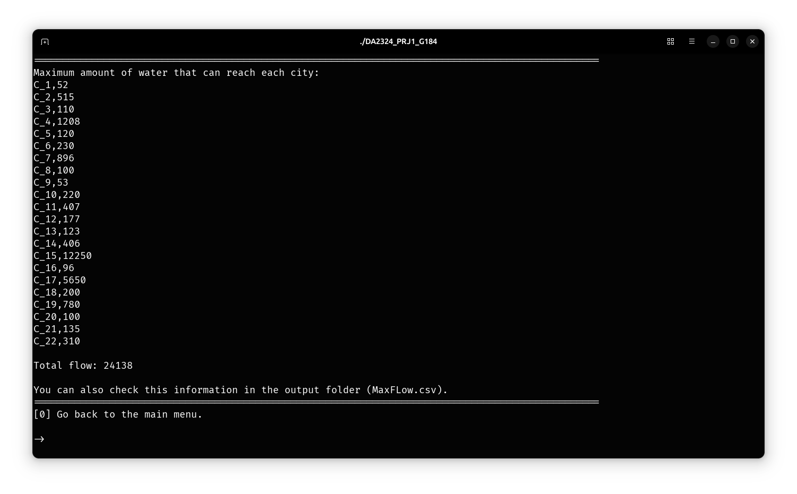
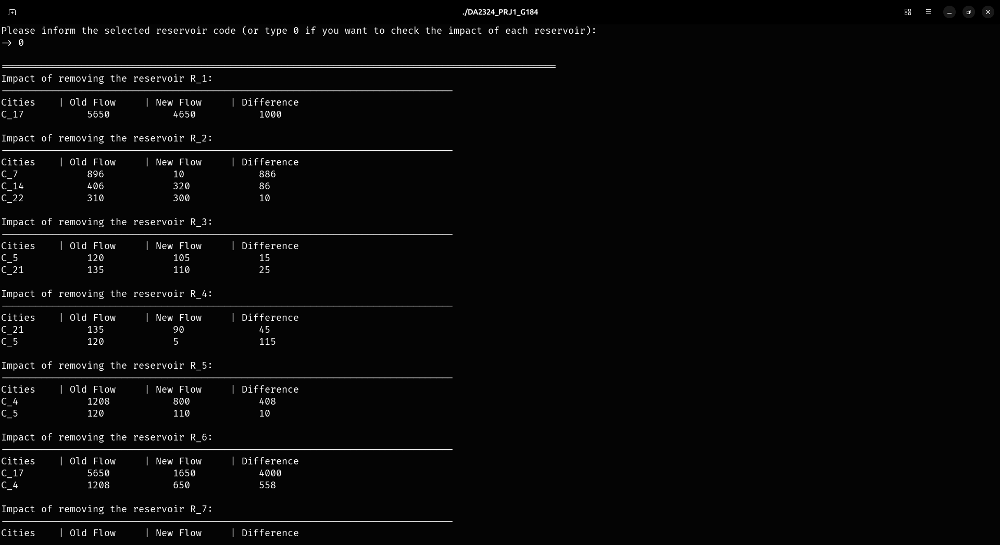

## Introduction

This is a C++ CLI tool designed to analyze and manage water distribution networks. By modeling the network as a directed graph of reservoirs, pumping stations, and delivery sites interconnected by pipelines, the system supports informed decision-making in water resource allocation. Its primary objective is to provide management teams with the tools to assess the capacity of the network, evaluate potential failures, and plan resource investments effectively.

## Overview

This project uses real-world data to simulate the Portuguese continental water supply network. The dataset consists of 4 CSV files:

- **Reservoirs.csv**: Contains water reservoir details such as name, municipality, unique identifiers, and maximum delivery capacity.
- **Stations.csv**: Provides simple reference data for pumping stations.
- **Cities.csv**: Details delivery sites, including city names, water demand, and population.
- **Pipes.csv**: Describes the network's pipelines, specifying the source and target service points, capacity, and connection direction (unidirectional or bidirectional).

The network is structured as a directed graph where each node can be a water reservoir, pumping station, or city. Edges (pipelines) are annotated with their capacity and are used to model the flow of water through the network.

## Implementation

The project is organized into five main modules:

- **Utils**: Contains auxiliary functions such as the implementation of the Edmonds-Karp algorithm.
- **Node**: Defines the `Node` class, representing the various components of the water network (reservoirs, stations, cities).
- **WaterNetwork**: Constructs the network by parsing CSV files and populating the graph data structure. It also implements functions to compute metrics and simulate network impacts.
- **App**: Implements the user interface for interacting with the system.
- **Main**: The entry point that runs the application.

## Key Functions

- **Single-Sink Maximum Flow**: Computes the maximum water flow to a specific city by introducing a super source and super sink into the network.
- **Multi-Sink Flow Analysis**: Evaluates the impact of changes across multiple delivery sites, including the calculation of water deficits.
- **Reliability Metrics**: Functions to evaluate the impact of removing reservoirs or pumping stations, as well as the effect of pipeline failures on water delivery.

### Edmonds-Karp Maximum Flow Algorithm

This function implements the Edmonds-Karp algorithm to determine the maximum flow in the water network. It uses a breadth-first search (BFS) to identify augmenting paths and iteratively augments the flow until no further improvements are possible.

```cpp
void edmondsKarp(Graph<Node> *g, Node source, Node target)
{
    // Find source and target vertices in the graph
    Vertex<Node> *s = g->findVertex(source);
    Vertex<Node> *t = g->findVertex(target);

    // Validate source and target vertices
    if (s == nullptr || t == nullptr || s == t)
        throw logic_error("Invalid source and/or target vertex");

    // Initialize flow on all edges to 0
    for (Vertex<Node> *v : g->getVertexSet())
        for (Edge<Node> *e : v->getAdj())
            e->setFlow(0);

    // While there is an augmenting path, augment the flow along the path
    while (findAugmentingPath(g, s, t))
    {
        double f = findMinResidualAlongPath(s, t);
        augmentFlowAlongPath(s, t, f);
    }
}
```

### Multi-Sink Maximum Flow Calculation

This function calculates the maximum water flow available to all the cities in the network. It simplifies the maximum flow computation by creating a super source and super sink. The function then aggregates the flow from all incoming edges at each target city and resets the graph for subsequent analyses.

```cpp
vector<pair<string, double>> WaterNetwork::multiSinkMaxFlow(Graph<Node> *g, const bool &flag) const
{
    vector<pair<string, double>> res;
    double flow;

    Node s = createSuperSource(g);
    Node t = createSuperSink(g);
    edmondsKarp(g, s, t);

    ofstream out;
    if (flag)
    {
        filesystem::path outputPath("../out");
        if (!filesystem::exists(outputPath))
            filesystem::create_directories(outputPath);
        out.open("../out/MaxFlow.csv");
        out << "CityCode,Flow\r";
    }

    for (Vertex<Node> *v : g->getVertexSet())
    {
        if (v->getInfo().getType() == 2 && v->getInfo().getCode() != "superSink")
        {
            res.push_back(make_pair(v->getInfo().getCode(), v->getCurrentFlow()));
            out << v->getInfo().getCode() << ',' << v->getCurrentFlow() << '\r';
        }
    }

    resetGraph(g, s, t);
    out.close();
    return res;
}
```

Output:



### Evaluate the network resiliency if a reservoir gets out of commission

This function evaluates the impact of a specific reservoir on the overall water distribution network. It calculates the maximum water flow available to all cities before and after considering the reservoir's maximum delivery capacity. The function identifies the connected component of the network that includes the specified reservoir and simulates the effect of utilizing the reservoir's full capacity.

```cpp
void WaterNetwork::evaluateReservoirImpact(const string &reservoir_code) const
{
    Node reservoir(reservoir_code);
    Vertex<Node> *reservoir_vertex = network->findVertex(reservoir);

    if (reservoir_vertex == nullptr || reservoir_vertex->getInfo().getType() != 0)
        throw runtime_error("Please inform a valid reservoir code.");
    reservoir = reservoir_vertex->getInfo();

    vector<pair<string, double>> previousFlow = multiSinkMaxFlow(network, true);

    Graph<Node> *subgraph = findConnectedComponent(network, reservoir_code);
    Vertex<Node> *subgraph_vertex = subgraph->findVertex(reservoir);
    subgraph_vertex->setUsedDelivery(subgraph_vertex->getInfo().getMaxDelivery());
    vector<pair<string, double>> currentFlow = multiSinkMaxFlow(subgraph, false);

    // I have omitted the print statement for the purpose of this post.
    reservoir_vertex->setUsedDelivery(0);
}
```

Output:


